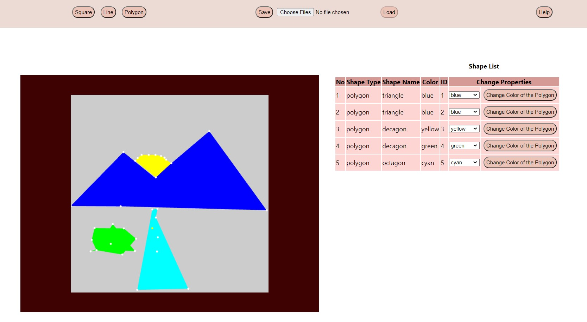

# web-based-CAD

A web-based app with CAD (computer aided design) feature, implemented using WebGL.

## Contributors
* Aqil Abdul Aziz Syafiq (13518002)
* Farras Mohammad Hibban Faddila (13518017)
* Florencia Wijaya (13518020)